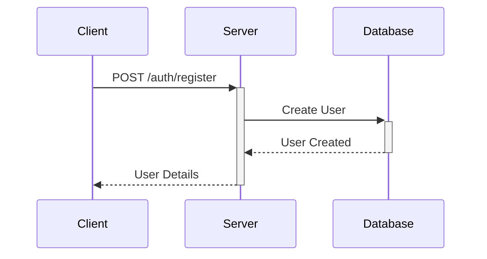
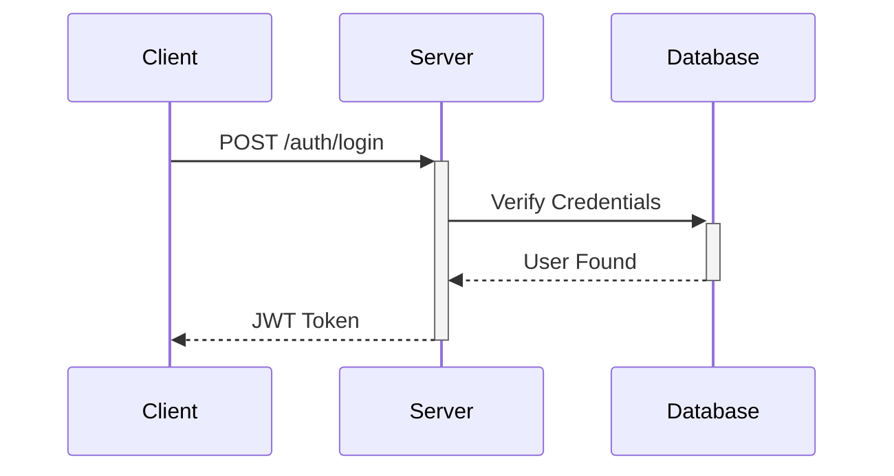
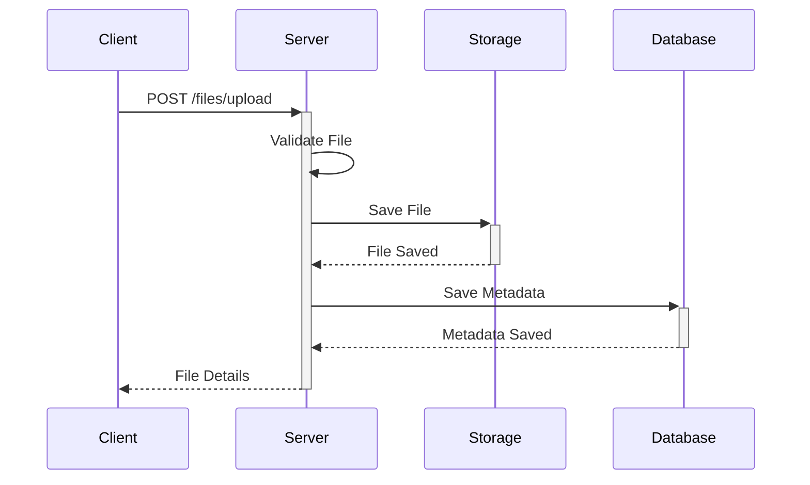

# DataSnap Architecture Documentation

## Overview

DataSnap is a modern web application designed for data analysis and visualization. It provides an intuitive interface for uploading and analyzing CSV files, with features for authentication, data visualization, and community interaction.

## System Architecture

### High-Level Architecture

```
+----------------+     +----------------+     +----------------+
|                |     |                |     |                |
|    Frontend    |<--->|    Backend     |<--->|    Database    |
|    (React)     |     |   (FastAPI)    |     |  (PostgreSQL)  |
|                |     |                |     |                |
+----------------+     +----------------+     +----------------+
                             |
                             v
                      +----------------+
                      |  File Storage  |
                      |    (Local)     |
                      |                |
                      +----------------+
```

### Component Description

#### Frontend (React + TypeScript)
- Single Page Application (SPA)
- Built with React and TypeScript
- Uses Vite for development and building
- Components:
  - Authentication (Login/Register)
  - Dashboard
  - File Management
  - Data Visualization (future)
  - Community Feed (future)

#### Backend (FastAPI)
- REST API built with FastAPI
- Python 3.12+
- Features:
  - JWT Authentication
  - File Upload/Download
  - Data Processing
  - User Management

#### Database (PostgreSQL)
- Relational database
- Stores:
  - User data
  - File metadata
  - Analysis results
  - Community interactions

#### File Storage
- Local file system storage
- Organized by user
- Supports CSV files

## Data Flow

### Authentication Flow

1. User Registration:


2. User Login:


### File Upload Flow



## Security Architecture

### Authentication
- JWT-based authentication
- Token expiration and refresh
- Password hashing with bcrypt
- OAuth integration (Google)

### Authorization
- Role-based access control
- Resource ownership validation
- API endpoint protection

### Data Security
- Input validation
- File type verification
- Size limitations
- Secure file storage

## Database Schema

### Users Table
```sql
CREATE TABLE users (
    id VARCHAR PRIMARY KEY,
    email VARCHAR UNIQUE NOT NULL,
    full_name VARCHAR,
    hashed_password VARCHAR,
    is_active BOOLEAN DEFAULT TRUE,
    is_superuser BOOLEAN DEFAULT FALSE,
    oauth_provider VARCHAR,
    oauth_id VARCHAR,
    created_at TIMESTAMP WITH TIME ZONE DEFAULT NOW(),
    updated_at TIMESTAMP WITH TIME ZONE
);
```

### Files Table
```sql
CREATE TABLE files (
    id VARCHAR PRIMARY KEY,
    filename VARCHAR NOT NULL,
    file_path VARCHAR NOT NULL,
    file_size INTEGER NOT NULL,
    content_type VARCHAR NOT NULL,
    user_id VARCHAR NOT NULL REFERENCES users(id),
    created_at TIMESTAMP WITH TIME ZONE DEFAULT NOW(),
    updated_at TIMESTAMP WITH TIME ZONE
);
```

## API Architecture

### REST API Structure
- /api/v1/auth - Authentication endpoints
- /api/v1/files - File management endpoints
- /api/v1/users - User management endpoints (future)
- /api/v1/analysis - Data analysis endpoints (future)
- /api/v1/community - Community features (future)

### API Design Principles
- RESTful design
- Resource-based URLs
- Standard HTTP methods
- Consistent error responses
- Proper status codes
- JWT authentication
- Input validation
- Rate limiting

## Frontend Architecture

### Component Structure
```
src/
├── components/         # Reusable UI components
│   ├── Button/
│   ├── Input/
│   └── DropZone/
├── pages/             # Page components
│   ├── Login/
│   ├── Register/
│   └── Dashboard/
├── services/          # API services
├── hooks/             # Custom hooks
├── utils/             # Utility functions
└── styles/            # Global styles
```

### State Management
- React Context for global state
- Local state for component-specific data
- JWT token management
- File upload state
- User session management

## Development and Deployment

### Development Environment
- Docker Compose for local development
- Hot reloading for both frontend and backend
- Development-specific configurations
- Local PostgreSQL instance

### Production Deployment
- Docker containers
- Nginx reverse proxy
- PostgreSQL database
- Volume mounts for file storage
- Environment-specific configurations

### Monitoring and Logging
- Application logs
- Database monitoring
- File system monitoring
- Error tracking
- Performance metrics

## Future Extensions

### Planned Features
1. Data Analysis
   - CSV parsing and analysis
   - Data visualization
   - Statistical analysis
   - Custom reports

2. AI Integration
   - Data insights
   - Pattern recognition
   - Automated analysis
   - Natural language processing

3. Community Features
   - Shared datasets
   - Collaboration tools
   - Comments and discussions
   - User profiles

### Technical Improvements
1. Scalability
   - Load balancing
   - Caching
   - Database optimization
   - File storage optimization

2. Security
   - Enhanced authentication
   - File encryption
   - Audit logging
   - Security scanning

3. Performance
   - Frontend optimization
   - Backend optimization
   - Database indexing
   - Caching strategies